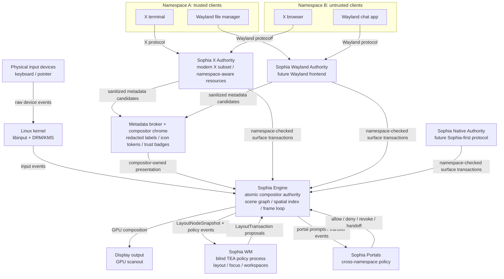

# Sophia

Sophia is a research prototype for an Engine-centered, transaction-first desktop
architecture.

Sophia Engine owns physical input, the scene graph, frame scheduling, atomic
visual commits, rendering, and scanout. Client protocols are handled by
namespace-aware **protocol authorities** that translate their native semantics
into Sophia surfaces and transactions. The first long-term authority target is a
modern X protocol subset inspired by Phoenix, not a permanent dependency on
Xorg or XLibre internals.

The core rendering rule is:

```text
Sophia must not present new geometry unless it also has the matching committed
pixels for that geometry.
```

This borrows the macOS lesson: visual state changes should become atomic
transactions. Slow or non-cooperative clients may lag behind the user's request,
but the compositor should keep presenting the last known good surface state
instead of exposing black borders, half-resized buffers, or torn layouts.

## Engine-Centered Architecture



## Data Path

**Input path.** Input reaches Sophia Engine first. The engine owns the actual
scene graph, transforms, and output geometry, so it maps physical coordinates to
visual surfaces before asking a protocol authority to perform protocol-specific
delivery semantics.

**Authority path.** Each authority terminates one client protocol. A Sophia X
Authority speaks a modern X subset; a future Sophia Wayland Authority speaks
Wayland; future native tools may use a Sophia-native authority. Authorities own
protocol semantics, resource tables, and namespace checks for their clients, but
they do not own layout, scanout, global shortcuts, compositor chrome, or
cross-namespace policy.

**Atomic render path.** The WM sends layout proposals to Sophia Engine. Protocol
authorities provide pending buffers, damage, constraints, and readiness. The
engine commits geometry and matching pixels as a unit on a frame boundary. If a
surface is not ready, Sophia keeps scanning out the last committed good state
until policy explicitly degrades.

## Project Shape

- **Sophia Engine** owns physical input, visual state, frame scheduling, atomic
  transactions, rendering, and display output.
- **Protocol Authorities** own client-protocol compatibility and translate
  protocol state into Sophia surface transactions.
- **Sophia WM** owns policy: layout, focus policy, keybindings, workspaces, and
  launch decisions.
- **Sophia Portals** mediate intentional namespace crossing for clipboard,
  drag-and-drop, file access, screenshots, notifications, and URI handoff.
- **Metadata Broker and Chrome** turn protocol metadata into sanitized
  compositor-owned presentation state without granting the WM namespace
  visibility.

## Reference Map

Sophia should borrow from existing systems at the right boundary, not copy any
one project wholesale.

- **Phoenix** is the modern X authority reference: a clean-room X server can
  support real applications without carrying all Xorg/XLibre baggage.
- **macOS WindowServer/Core Animation** is the transaction reference: geometry
  and pixels must commit together.
- **niri** is the Rust compositor reference: Smithay backend structure,
  KMS/libinput integration, frame-clock behavior, transaction timeouts, headless
  test patterns, and visual-test style.
- **picom** remains an X-side research reference: XComposite, Damage, X window
  tree mirroring, top-level/client detection, and damage calculation across
  buffered layouts.
- **river** is the policy split reference: the compositor keeps the hot path and
  the external WM receives only policy-relevant sequences.
- **XLibre** remains useful as a prototype/reference for Xnamespace, X11
  delivery semantics, and routed-input research, but it is no longer the target
  center of the architecture.

The first implementation should combine these lessons without becoming any of
them. Sophia is not a niri fork, not a picom-style X compositor, not Xwayland,
and not a permanent wrapper around XLibre.

## Documentation

- `docs/architecture.md` maps processes and load-bearing boundaries.
- `docs/dod.md` defines Sophia's data-oriented design rules.
- `docs/style-guide.md` records implementation discipline.
- `docs/research-log.md` captures early decisions and open research questions.
- `docs/xlibre-prototype-regression-map.md` classifies XLibre prototype checks.
- `todo.md` tracks build phases and research milestones.

## License

Sophia is licensed under the BSD 3-Clause License. See `LICENSE`.
