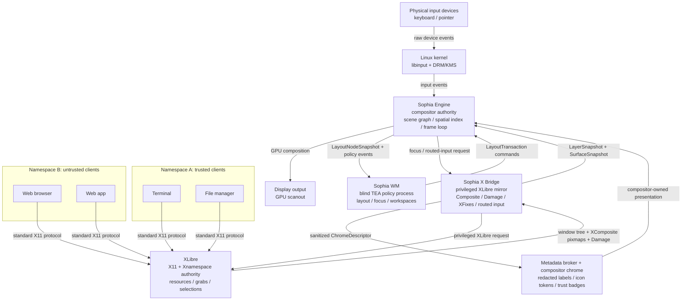

# Sophia

Sophia is a research prototype for a modern X11 session.

XLibre remains the client-facing X11 server, resource authority, window-system
authority, and Xnamespace isolation layer. Sophia supplies the modern display
engine around it: compositor-first input, frame-aware rendering, and an external
window-manager policy process.

Sophia is not Xwayland and not a Wayland compositor with X11 compatibility as a
sidecar. It is an XLibre-centered attempt to modernize X11 by moving physical
input, final composition, and display timing out of the legacy server hot path
while preserving X11 client compatibility.

## The Modernized X11 Architecture

## Data Path

**Path 1 and 2, the hot path.** Input reaches Sophia's compositor first. The
compositor owns the actual scene graph, transforms, and output geometry, so it
can map physical coordinates to visual surfaces without asking XLibre to guess
from a flat legacy window tree. Global shortcuts are handled by the compositor
and forwarded to the external WM over Sophia's private policy protocol.

**Path 3 and 4, the sandbox path.** The WM or session launcher starts apps with
namespace-specific X11 credentials. Apps still speak ordinary X11 to XLibre.
XLibre applies Xnamespace isolation so a client can see and affect only the
resources inside its namespace.

**Path 5 and 6, the render loop.** The WM sends atomic policy updates to the
compositor. XLibre redirects X11 windows to offscreen pixmaps through XComposite
and reports damage. Sophia imports those updates into its scene graph and
presents coherent frames.

## Project Shape

- **Sophia Engine** owns physical input, the scene graph, frame scheduling, and
  display output.
- **Sophia WM** owns policy: layout, focus policy, keybindings, workspaces, and
  launch decisions.
- **XLibre** owns X11 protocol compatibility, resources, selections, grabs, and
  Xnamespace enforcement.
- **Sophia X Bridge** is the privileged integration layer between XLibre and the
  compositor.
- **Sophia Portals** mediate intentional namespace crossing for clipboard,
  drag-and-drop, file access, screenshots, and notifications.

## Reference Map

Sophia should borrow from existing systems at the right boundary, not copy any
one project wholesale.

- **niri** is the Rust compositor reference: Smithay backend structure,
  KMS/libinput integration, frame-clock behavior, transaction timeouts, headless
  test patterns, and visual-test style.
- **picom** is the X-side compositor reference: XComposite, Damage, X window
  tree mirroring, top-level/client detection, layer snapshots, render command
  planning, and buffer-age damage calculation.
- **river** is the policy split reference: the compositor keeps the hot path and
  the external WM receives only policy-relevant sequences.
- **XLibre** is the server authority: X11 protocol, Xnamespace, selections,
  resources, grabs, and the future routed-input extension target.

The first implementation should combine these lessons without becoming any of
them. Sophia is not a niri fork, not picom with KMS, and not Xwayland.

## Documentation

- `docs/architecture.md` maps processes and load-bearing boundaries.
- `docs/dod.md` defines Sophia's data-oriented design rules.
- `docs/style-guide.md` records implementation discipline.
- `docs/research-log.md` captures early decisions and open research questions.
- `todo.md` tracks build phases and research milestones.
