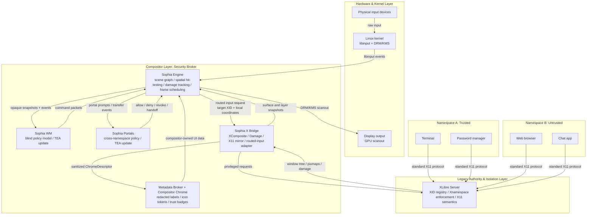

# Architecture

This doc maps Sophia's processes and the boundaries between them. The data model
is in `dod.md`; code-level rules live in `style-guide.md`.

Sophia is XLibre-centered. XLibre is not a guest compatibility server hidden
inside a Wayland desktop. It remains the authority X11 clients talk to. Sophia
adds a modern display engine and an external policy layer around that authority.

## Processes



The critical split is that surface and layer snapshots flow from Sophia X Bridge
to Sophia Engine, while sanitized chrome descriptors flow to the metadata
broker. The WM receives only opaque policy data and returns command packets.

## Load-Bearing Boundaries

### TEA Boundary Rule

Sophia uses The Elm Architecture as a policy-boundary discipline where it fits:
snapshots and events enter a policy process, that process updates its private
model, and it emits explicit command packets back to the authority that can
execute them.

This applies strongly to Sophia WM and portals. The WM consumes opaque layout
node snapshots and focus/workspace events, updates its layout model, and emits
`LayoutTransaction` commands. Portals consume transfer requests and policy
events, update transfer state, and emit allow, deny, revoke, or handoff
commands.

This does not apply as a universal compositor architecture. Sophia Engine is
performance and security centric: it owns libinput, scene graph state,
hit-testing, damage tracking, frame scheduling, and final scanout. Its hot paths
should be data-oriented systems over owned tables and precomputed snapshots, not
a single app-wide message loop.

### Compositor Strategy

Sophia Engine should follow Smithay-style compositor structure, using niri as a
read-only reference for how a production Rust compositor organizes backends,
renderers, outputs, frame clocks, input devices, and headless tests.

Sophia should not fork niri. Niri combines compositor and window-management
policy in one central state object, while Sophia deliberately splits policy into
Sophia WM. The reusable idea is the compositor machinery, not the process model.

Sophia X Bridge should follow picom conceptually for the X side. Picom imports
the X window tree, tracks top-levels and stacking, redirects windows with
XComposite, consumes Damage, builds flat layer snapshots, and computes damage
across buffered layouts. Sophia needs those same data products, but it must hand
them to Sophia Engine instead of rendering back into the X root.

Do not turn Sophia into a traditional X compositor. XLibre remains the X11
authority, but Sophia owns final scanout and physical input.

### Engine to WM

The WM protocol is a policy boundary. The WM receives state changes that need
policy decisions: new windows, destroyed windows, output changes, keybindings,
workspace changes, and focus-affecting events.

The WM is blind to X11 identity and namespace identity. It manages opaque layout
nodes keyed by Sophia `SurfaceId`, not XIDs. The protocol must not expose raw
window titles, classes, icons, PIDs, namespace IDs, or X11 resource IDs.

User-facing chrome such as titles, icons, attention indicators, and trust badges
belongs to Sophia Engine or a compositor-shell component fed by a metadata
broker. The broker may consume X metadata from Sophia X Bridge, but it exports
sanitized compositor chrome data separately from WM layout data. Sophia Engine
accepts that broker output as generation-checked sanitized metadata and applies
it to `ChromeDescriptor` state; raw XIDs, namespace IDs, titles, classes, PIDs,
and icon pixels do not cross this boundary.

The WM is not on the per-frame or per-input hot path. Sophia Engine keeps the
last committed policy state if the WM crashes or restarts.

The WM control flow is Engine-only. Sophia Engine mints every transaction ID,
sends the request, applies a strict response timeout, and treats the WM reply as
a proposal. The WM must not initiate layout transactions, push unsolicited
commands, or drive animations frame-by-frame. If a layout should animate, the
WM may provide the target layout; Sophia Engine owns the frame clock,
interpolation, cancellation, and final commit.

The socket protocol is a versioned, length-prefixed binary frame. Integers are
little-endian and decoded with explicit fixed-offset parsing, not `repr(C)`
casts or generic serializers. Payloads are bounded before allocation.
Sophia Engine owns the request/response transport: it writes exactly one
`WmRequestPacket`, reads one bounded `WmResponsePacket`, and rejects a response
whose transaction ID does not match the Engine-minted request transaction.
If the response is missing, malformed, oversized, or mismatched, Sophia Engine
preserves the last committed layout and reports the transaction as timed out.
Those IPC failures produce a runtime restart decision for the WM process. A
valid response whose proposed layout is rejected does not restart the WM; it is
a policy proposal failure, not a transport/protocol failure.

The protocol should be sequence-oriented:

- **Manage sequence** for state that affects clients: size, focus, fullscreen,
  workspace assignment, activation.
- **Render sequence** for compositor-only state: position, z-order, crop,
  decoration geometry, opacity, transforms.
- **Chrome sequence** for compositor-owned presentation metadata: redacted
  display labels, icon tokens, trust badges, and attention state. This sequence
  is not consumed by the WM. Stale metadata generations are rejected so older
  broker output cannot overwrite newer chrome state.

### Engine to XLibre Rendering

XComposite and Damage are the first render seam. XLibre redirects windows to
offscreen pixmaps and reports changed regions. Sophia X Bridge names or imports
those pixmaps, tracks damage, and hands frame packets to Sophia Engine.

Sophia Engine separates frame validation from renderer/import execution. The
headless path validates `FrameSnapshot` commands, replays them into a
deterministic report, and then hands the validated frame to a `FrameRenderer`.
The conservative default renderer still uses CPU readback, but the renderer
contract now carries explicit imported buffer handles. `ImportCapableRenderer`
can report native `XPixmap` and `DmaBuf` handles when those import paths are
enabled, and falls back to CPU readback when a handle type is unsupported. A
production renderer can replace the skeleton import behavior while preserving
the same command-stream and import-report contract.

XComposite pixmap lifetime is tracked separately from render import. Sophia X
Bridge stores `CompositePixmapRecord` values keyed by client window, with a
generation for each named pixmap. Replacing a pixmap returns a lifetime update
containing both the new current record and the retired record; removing a window
returns the retired record with no current replacement. This gives the later
real renderer an explicit point to release old pixmap/import resources.

This seam exists today in broad shape. It needs measurement and glue, not a new
theory.

The first implementation should accept ordinary X11 limitations:

- X11 clients do not have Wayland-style configure/commit acknowledgements.
- Frame-perfect resize needs heuristics at first.
- Slow or non-cooperative clients may force a timeout frame.

### Engine to XLibre Input

This is the hard seam.

Current XLibre still routes pointer events through the legacy flat-window path:
coordinate to window, sprite trace, grabs, focus, then delivery. That cannot
represent compositor-side transforms, scaled scenes, 3D workspaces, or other
visual effects where rendered geometry diverges from XLibre's 2D tree.

Sophia needs a routed-input path:

```text
Sophia Engine hit-tests the real scene
        |
        v
target XID + local coordinates + device event packet
        |
        v
XLibre routed-input extension
        |
        v
DIX delivery with X11 grabs, focus, XI2, and Xnamespace checks preserved
```

The extension must not become "send arbitrary event directly to client." XLibre
still owns X11 delivery semantics. Sophia only supplies the visual target and
local coordinates that XLibre cannot compute by itself.

The smallest useful extension request is:

```text
XLibreRoutedInput {
    serial,
    seat,
    device,
    time_msec,
    target_xid,
    local_x,
    local_y,
    event_kind
}
```

This request is an alternate target selection path, not a delivery bypass.
XLibre must still reject stale XIDs, namespace violations, sync-frozen devices,
focus policy violations, and unsupported event forms before entering normal DIX
delivery. Ordinary active grabs remain XLibre authority and may redirect
delivery according to normal grab semantics.

Grab/focus edge smokes are represented as closed-route decision reports.
`x-smoke-routed-input-edges` verifies that `RejectedActiveGrab` and
`RejectedFocusPolicy` outcomes do not allow delivery and do not fall back to
direct client injection. Live active-grab redirection remains an XLibre DIX
responsibility; Sophia only records the edge decision and keeps the route
closed when XLibre rejects it.

The flat request path remains as a strict compatibility wrapper, but Sophia X
Bridge also accepts transformed routes when Sophia Engine has already hit-tested
the visual scene and supplied finite target-local coordinates. XLibre still
receives the same target XID plus local-coordinate packet; it is not asked to
understand compositor transforms.

The patch target is tracked in `docs/xlibre-routed-input-extension.md`.

The first implementation optimizes for correctness, not throughput tricks. The
ordinary `RouteEvent` request remains the canonical path until profiling shows
it is the bottleneck. Sophia Engine owns the first optimization through
`RoutedInputCoalescer`: it buffers at most one pure pointer-motion route per
stable target and flushes it at the frame boundary. Later optimizations should
be layered in this order:

- keep coalescing limited to pure pointer motion at frame boundaries when the
  target route is stable
- keep immediate flush barriers for button, key, target-crossing, drag, grab,
  and focus transitions
- use any grab/focus cache only as advisory acceleration; XLibre remains final
  authority
- consider an Engine-to-XLibre shared-memory route ring only after measurement,
  with the X11 request path kept as fallback

The first shared-memory ring, if built, should be unidirectional: Sophia Engine
publishes fixed-size route records and wakes XLibre with a small signal such as
`eventfd`. XLibre rejection and decision reporting can stay on the existing
control path until measurements justify a second status queue. A bidirectional
hot ring would couple the compositor's input loop to XLibre timing and should
not be introduced speculatively.

### Xnamespace Portals

Namespaces are private by default. Cross-namespace operations go through portal
services, not ad hoc server exceptions.

Initial portal candidates:

- clipboard and selections
- drag-and-drop
- file-open/file-save handoff
- screenshots and screen recording
- URI open requests
- notifications

The portal rule is the same everywhere: data crosses as an explicit packet with
source namespace, target namespace, type, size, policy decision, and lifetime.
Clipboard denial maps to native X11 selection failure, not synthetic input.
Pending approval holds only the transfer request for a bounded timeout; it does
not suspend either application or namespace.

The first portal implementation is the `sophia-portal` clipboard reducer. It
keeps transfers private and pending by default, accepts only text targets,
emits prompt, handoff, and fail-selection commands, and revokes pending
transfers when the source namespace owner generation changes. It does not yet
monitor X selections itself; Sophia X Bridge remains responsible for observing
namespaced selection ownership and converting X11 selection outcomes into
portal events.

Denied clipboard transfers now have the first concrete X11 failure adapter.
`PortalCommand::FailSelection` maps through Sophia X Bridge into a normal
`SelectionNotify` failure with `property = None`, matching ICCCM selection
conversion failure instead of injecting synthetic input or blocking clients.

Sophia X Bridge monitors selection ownership through XFixes
`SelectionNotify` events for `PRIMARY`, `SECONDARY`, and `CLIPBOARD`. The bridge
attributes each owner window to a known mirrored namespace when possible and
bumps a per-selection owner generation. Portal approval is bound to that
generation, so a later owner change makes old approval stale.

Sophia X Bridge also has the first requestor-side clipboard execution seam.
Given an X11 `SelectionRequest`, a resolved target atom name, the selection
owner monitor, and the mirrored namespace table, it can construct a
cross-namespace `ClipboardTransferRequest` plus the native failure reply
context. This still does not perform live X dispatch or approved clipboard data
handoff; it makes the request-to-portal boundary explicit and testable.

The runtime-facing dispatcher now accepts the real `x11rb`
`Event::SelectionRequest` variant and calls the clipboard portal reducer. It
fails closed for non-selection events, missing namespace attribution, same-
namespace requests, and unsupported targets. Approved data handoff remains
separate work.

The first drag-and-drop portal reducer follows the same rule. It records a
bounded list of offered transfer types, keeps the handoff pending/private until
explicit approval, binds approval to a source generation, and emits abstract
handoff or cancel commands. Xdnd/X11 event translation remains Sophia X Bridge
work; portal policy does not subscribe to X events directly.

File open/save handoff uses the same reducer boundary. It records open versus
save intent, a bounded offered-type list, an optional safe suggested filename,
and generation-bound approval state. Actual file chooser UI, file descriptors,
temporary handles, and namespace filesystem brokering are runtime work, not
portal policy state.

Screenshot and screen-recording requests are also policy-only at this layer.
The reducer records capture mode, redacted capture scope, supported output MIME
type, and generation-bound approval. Actual compositor capture, frame streaming,
redaction, and buffer handoff stay in Sophia Engine/runtime.

URI open requests are represented as explicit portal policy too. The reducer
stores only a bounded URI length, validates a conservative scheme allowlist,
requires generation-bound approval, and emits abstract handoff or cancel
commands. Until the protocol grows a dedicated URI kind, URI requests use a
`uri-open:` type hint on the generic portal transfer path.

Notification requests complete the first portal policy set. The reducer stores
bounded summary/body/action text, urgency, and generation-bound approval state.
Approved `DeliverNotification` commands now pass through an Engine chrome
presenter before becoming compositor-visible notification state. Denied or
revoked `DropNotification` commands dismiss pending or visible chrome state.
Notification history, action dispatch, and rate limiting remain runtime policy
outside the portal reducer.

### Metadata Broker And Chrome Actions

Compositor chrome is Engine/session authority, not WM authority. If the user
clicks a compositor-drawn close button, Sophia Engine hit-tests that chrome and
emits a surface-scoped close request with a generation check. Session/chrome
policy validates the request and asks Sophia X Bridge to perform the polite X11
close path first, such as `WM_DELETE_WINDOW` when available. The WM sees only
the later consequence through `SurfaceRemoved` or relayout requests.

The first session seam is a reducer inside Sophia Engine. A
`SessionEvent::ChromeAction` is validated against current layout nodes. Accepted
close requests emit `SessionCommand::RequestPoliteClose`, which the runtime
dispatches to Sophia X Bridge. Rejected chrome actions emit no command. This
keeps close intent out of the blind WM protocol.

Metadata broker output follows the same ownership split. The runtime gives
Sophia Engine only `SanitizedChromeMetadata`: surface identity, optional bounded
display label, redaction bit, compositor icon token, trust level, attention
state, and generation. `ChromeBroker` turns accepted updates into
`ChromeDescriptor` values and removes descriptors only when the removal
generation is not stale.

The WM notification is a separate lifecycle event. Only after XLibre/X Bridge
reports that the surface was actually removed does Sophia Engine process
`SessionEvent::SurfaceRemoved` and emit a `WmRequestKind::SurfaceRemoved`
command packet. This is the point where the WM may relayout; a chrome close
request itself never wakes the WM.

Process supervision is runtime policy, not compositor policy. Sophia Engine can
emit facts such as "WM IPC failed" or "restart the WM", but a runtime
supervisor reducer decides whether that becomes an immediate start, delayed
restart, or give-up decision based on a bounded restart policy. The supervisor
may manage the WM, portal broker, and metadata broker processes, but it does not
receive raw input, XIDs, namespace tokens, pixmaps, or portal payloads.

The process executor is below that reducer. It consumes supervisor commands,
spawns the configured child process after the bounded delay, polls for process
exit, and terminates owned children during cleanup. It does not mint restart
decisions or inspect compositor/session state.

The long-lived WM path uses the same bounded IPC frames as the in-memory socket
transport. `sophia-wm-demo serve-socket --socket=PATH` accepts repeated
Engine-owned transactions over a private Unix socket. The supervisor smoke
starts that process, commits a socket transaction, kills the child, applies the
restart policy, starts a fresh WM process, and commits a second transaction.

The compositor preserves a last-committed layout cache across WM absence. A
successful WM transaction replaces the cache. If the WM socket is missing,
malformed, timed out, or being restarted, Sophia restores that cache before
planning the next frame. Rejected layout proposals do not replace the cache.

The first session runtime step is a headless tick over existing engine data. A
tick consumes either fresh layer snapshots or an explicit restore request for
the last committed layout, then produces a frame snapshot and replay report.
This is not the final event loop; it is the smallest executable coordinator
between X-derived layer state, cached layout state, and frame planning.

The continuous runtime loop now has a data-only reducer. `SessionRuntimeState`
tracks the current phase and counters for X events, rendered frames, drained
portal commands, presented chrome commands, WM restart requests, and the last
frame serial. `update_session_runtime` consumes runtime facts such as
`TickStarted`, `XEventsPolled`, `WmLayoutReady`, `FrameScheduled`, and
`FrameRendered`, then emits explicit commands like `PollXEvents`,
`RequestWmLayout`, `ScheduleFrame`, `RenderFrame`, `DrainPortalCommands`, and
`PresentChrome`. This keeps the event loop assembly testable before wiring it
to real file descriptors.

The headless runtime tick smoke now drives this reducer around the existing
capture -> session tick -> replay path. It executes the reducer's X polling,
WM policy, frame scheduling, render, portal drain, and chrome presentation
commands in order and reports the resulting runtime counters beside the frame
snapshot/replay counts.

`runtime-damage-epoch-smoke` exercises the next runtime seam without requiring a
live slow-resize client. It creates an X-shaped `DamageFrame`, completes a
layout epoch through `schedule_frame_from_damage`, then drives the runtime
reducer through frame scheduling, rendering, portal drain, and chrome
presentation. The full XLibre smoke script runs this check alongside the live X
capture smokes.

Portal and metadata brokers now have process-supervised placeholders.
`RuntimeBrokerSupervisors` owns one `ProcessSupervisor` for `PortalBroker` and
one for `MetadataBroker`; `runtime-brokers-smoke` starts both placeholder
processes and observes their exits. This proves restart/supervision ownership
without claiming the broker IPC protocols or UI surfaces are implemented.

The first broker IPC contract is health/control only.
`BrokerHealthPacket` is intentionally small: broker kind, coarse health state,
generation, and an optional bounded status message. It cannot carry raw client
metadata, namespace labels, XIDs, portal payloads, URIs, file paths, or icon
bytes. Runtime may later consume this packet to mark a broker ready, degraded,
or stopped, but real portal execution and sanitized chrome metadata remain
separate protocols with their own validation. The portal broker placeholder now
has a bounded health-frame smoke that encodes and decodes the packet over the
shared Sophia IPC frame header; the metadata broker placeholder uses the same
control frame. The session runtime reducer consumes decoded health as reduced
state only: broker health state, generation, and status-message length.

Frame scheduling now has an explicit seam. `FrameClock` produces output-scoped
frame ticks, and the deterministic headless implementation advances serials
without depending on wall-clock time. A real DRM/KMS backend should implement
the same boundary from vblank/page-flip timing while preserving the existing
session-tick contract: clock tick in, frame snapshot and replay/commit report
out.

X Damage now participates in frame scheduling. `schedule_frame_from_damage`
combines a frame-clock tick, an optional X-derived `DamageFrame`, and an
optional layout epoch. If no damage exists, the scheduler waits. If a layout
epoch is pending, damage from affected surfaces retires pending surface IDs;
rendering waits until the epoch completes. When damage is present and the epoch
is complete, the scheduler emits a render decision with the tick's frame serial.

Resize behavior measurement is tied to the same epoch state. `LayoutEpochState`
records start time and timeout policy, and `measure_resize_behavior` reports
elapsed time, pending surfaces, completion, and timeout status. Slow or
non-cooperative clients therefore become explicit samples instead of implicit
black frames or hidden scheduler stalls.

The DRM/KMS output backend starts as a data-only skeleton. `DrmKmsMode`,
`DrmKmsOutputDescriptor`, and `DrmKmsOutputRegistry` preserve connector ID,
CRTC ID, mode, scale, and Sophia `OutputId` without opening devices yet. The
descriptor can seed an engine output, which lets frame planning consume the same
shape the real backend will later discover from KMS.

The libinput backend starts the same way. `LibinputDeviceDescriptor` records the
seat, device, and broad device kind that future libinput discovery will
produce. `LibinputEventSource` accepts `InputEventPacket` values only from
registered device/seat pairs and drains them in order for the routing pipeline.
It is not a real file-descriptor poller yet; it is the typed intake seam that
physical input will feed.

Physical input now has a request-generation seam. After Sophia Engine produces
an `InputRoute`, `routed_input_request_from_physical_event` combines the
physical `InputEventPacket` with the accepted route and emits an
`XLibreRoutedInputRequest`. The adapter rejects serial mismatches, denied or
unrouted outcomes, missing target windows, and missing local coordinates. A
coalescer flush can be converted into a bounded batch of routed-input requests
without involving WM policy.

Scene hit-testing now handles transformed layer geometry. Sophia Engine walks
renderable layers from highest stack rank to lowest, inverts each layer's
transform against the physical pointer position, checks the untransformed layer
geometry, and emits an `InputRoute` with target-local coordinates. That route
feeds the same routed-input request generator, so compositor-side transforms are
resolved before XLibre receives the target XID and local position.

XFixes selection owner updates are the first portal execution input. Sophia X
Bridge converts owner-generation changes into source-namespace clipboard events;
the clipboard portal reducer uses those events to revoke stale pending
transfers. X11 `SelectionRequest` context can now become a bounded clipboard
portal import request and native failure reply context, and the X bridge can
dispatch the real `Event::SelectionRequest` into the clipboard portal reducer.
Full live paste import still requires approved data handoff.

## XLibre Responsibilities

XLibre remains responsible for:

- X11 protocol parsing and replies
- client resource ownership
- XID allocation and lookup
- Xnamespace enforcement
- X11 selections and clipboard ownership
- X11 grabs, focus, and delivery semantics
- ICCCM/EWMH compatibility surface

Sophia should not duplicate those concepts in another object graph. It should
mirror only the data it needs for rendering and policy.

## Sophia Responsibilities

Sophia owns:

- physical input devices
- output configuration
- scene graph and transforms
- damage aggregation and frame scheduling
- final composition
- global shortcuts
- compositor-to-WM policy protocol
- portal UI hooks

Sophia Engine can cache XLibre state, but XLibre remains the source of truth for
X11 resources.

## First Research Thread

The first useful proof is not a full desktop. It is a vertical slice:

1. Start XLibre with Xnamespace enabled.
2. Launch one X11 client in one namespace.
3. Redirect that client's window through XComposite.
4. Show it in Sophia Engine's scene.
5. Move and resize it through Sophia WM policy.
6. Deliver flat, untransformed input or explicitly mark transformed input
   unsupported until routed input exists.
7. Verify namespace isolation still works.

That slice proves the rendering seam and the process split. Routed input is the
next research milestone.

## Reference Boundaries

Use each reference at the boundary where it is strongest:

- niri: Rust/Smithay backend patterns, frame scheduling, renderer integration,
  headless test scaffolding.
- picom: XComposite/Damage flow, X window mirror, layer snapshots, render
  command planning, damage over buffer age.
- river: external WM protocol shape, manage/render sequence thinking, crash
  isolation for policy.
- XLibre: namespace enforcement, X11 delivery semantics, future routed-input
  protocol.
