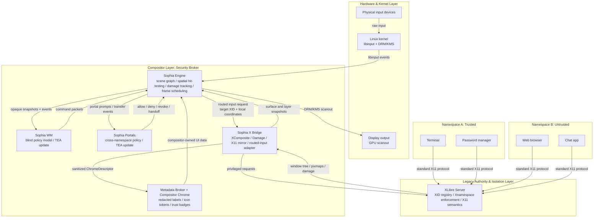

# Architecture

This doc maps Sophia's processes and the boundaries between them. The data model
is in `dod.md`; code-level rules live in `style-guide.md`.

Sophia is XLibre-centered. XLibre is not a guest compatibility server hidden
inside a Wayland desktop. It remains the authority X11 clients talk to. Sophia
adds a modern display engine and an external policy layer around that authority.

## Processes



The critical split is that surface and layer snapshots flow from Sophia X Bridge
to Sophia Engine, while sanitized chrome descriptors flow to the metadata
broker. The WM receives only opaque policy data and returns command packets.

## Load-Bearing Boundaries

### TEA Boundary Rule

Sophia uses The Elm Architecture as a policy-boundary discipline where it fits:
snapshots and events enter a policy process, that process updates its private
model, and it emits explicit command packets back to the authority that can
execute them.

This applies strongly to Sophia WM and portals. The WM consumes opaque layout
node snapshots and focus/workspace events, updates its layout model, and emits
`LayoutTransaction` commands. Portals consume transfer requests and policy
events, update transfer state, and emit allow, deny, revoke, or handoff
commands.

This does not apply as a universal compositor architecture. Sophia Engine is
performance and security centric: it owns libinput, scene graph state,
hit-testing, damage tracking, frame scheduling, and final scanout. Its hot paths
should be data-oriented systems over owned tables and precomputed snapshots, not
a single app-wide message loop.

### Compositor Strategy

Sophia Engine should follow Smithay-style compositor structure, using niri as a
read-only reference for how a production Rust compositor organizes backends,
renderers, outputs, frame clocks, input devices, and headless tests.

Sophia should not fork niri. Niri combines compositor and window-management
policy in one central state object, while Sophia deliberately splits policy into
Sophia WM. The reusable idea is the compositor machinery, not the process model.

Sophia X Bridge should follow picom conceptually for the X side. Picom imports
the X window tree, tracks top-levels and stacking, redirects windows with
XComposite, consumes Damage, builds flat layer snapshots, and computes damage
across buffered layouts. Sophia needs those same data products, but it must hand
them to Sophia Engine instead of rendering back into the X root.

Do not turn Sophia into a traditional X compositor. XLibre remains the X11
authority, but Sophia owns final scanout and physical input.

### Engine to WM

The WM protocol is a policy boundary. The WM receives state changes that need
policy decisions: new windows, destroyed windows, output changes, keybindings,
workspace changes, and focus-affecting events.

The WM is blind to X11 identity and namespace identity. It manages opaque layout
nodes keyed by Sophia `SurfaceId`, not XIDs. The protocol must not expose raw
window titles, classes, icons, PIDs, namespace IDs, or X11 resource IDs.

User-facing chrome such as titles, icons, attention indicators, and trust badges
belongs to Sophia Engine or a compositor-shell component fed by a metadata
broker. The broker may consume X metadata from Sophia X Bridge, but it exports
sanitized compositor chrome data separately from WM layout data.

The WM is not on the per-frame or per-input hot path. Sophia Engine keeps the
last committed policy state if the WM crashes or restarts.

The WM control flow is Engine-only. Sophia Engine mints every transaction ID,
sends the request, applies a strict response timeout, and treats the WM reply as
a proposal. The WM must not initiate layout transactions, push unsolicited
commands, or drive animations frame-by-frame. If a layout should animate, the
WM may provide the target layout; Sophia Engine owns the frame clock,
interpolation, cancellation, and final commit.

The socket protocol is a versioned, length-prefixed binary frame. Integers are
little-endian and decoded with explicit fixed-offset parsing, not `repr(C)`
casts or generic serializers. Payloads are bounded before allocation.
Sophia Engine owns the request/response transport: it writes exactly one
`WmRequestPacket`, reads one bounded `WmResponsePacket`, and rejects a response
whose transaction ID does not match the Engine-minted request transaction.
If the response is missing, malformed, oversized, or mismatched, Sophia Engine
preserves the last committed layout and reports the transaction as timed out.
Those IPC failures produce a runtime restart decision for the WM process. A
valid response whose proposed layout is rejected does not restart the WM; it is
a policy proposal failure, not a transport/protocol failure.

The protocol should be sequence-oriented:

- **Manage sequence** for state that affects clients: size, focus, fullscreen,
  workspace assignment, activation.
- **Render sequence** for compositor-only state: position, z-order, crop,
  decoration geometry, opacity, transforms.
- **Chrome sequence** for compositor-owned presentation metadata: redacted
  display labels, icon tokens, trust badges, and attention state. This sequence
  is not consumed by the WM.

### Engine to XLibre Rendering

XComposite and Damage are the first render seam. XLibre redirects windows to
offscreen pixmaps and reports changed regions. Sophia X Bridge names or imports
those pixmaps, tracks damage, and hands frame packets to Sophia Engine.

This seam exists today in broad shape. It needs measurement and glue, not a new
theory.

The first implementation should accept ordinary X11 limitations:

- X11 clients do not have Wayland-style configure/commit acknowledgements.
- Frame-perfect resize needs heuristics at first.
- Slow or non-cooperative clients may force a timeout frame.

### Engine to XLibre Input

This is the hard seam.

Current XLibre still routes pointer events through the legacy flat-window path:
coordinate to window, sprite trace, grabs, focus, then delivery. That cannot
represent compositor-side transforms, scaled scenes, 3D workspaces, or other
visual effects where rendered geometry diverges from XLibre's 2D tree.

Sophia needs a routed-input path:

```text
Sophia Engine hit-tests the real scene
        |
        v
target XID + local coordinates + device event packet
        |
        v
XLibre routed-input extension
        |
        v
DIX delivery with X11 grabs, focus, XI2, and Xnamespace checks preserved
```

The extension must not become "send arbitrary event directly to client." XLibre
still owns X11 delivery semantics. Sophia only supplies the visual target and
local coordinates that XLibre cannot compute by itself.

The smallest useful extension request is:

```text
XLibreRoutedInput {
    serial,
    seat,
    device,
    time_msec,
    target_xid,
    local_x,
    local_y,
    event_kind
}
```

This request is an alternate target selection path, not a delivery bypass.
XLibre must still reject stale XIDs, namespace violations, sync-frozen devices,
focus policy violations, and unsupported event forms before entering normal DIX
delivery. Ordinary active grabs remain XLibre authority and may redirect
delivery according to normal grab semantics.

The flat request path remains as a strict compatibility wrapper, but Sophia X
Bridge also accepts transformed routes when Sophia Engine has already hit-tested
the visual scene and supplied finite target-local coordinates. XLibre still
receives the same target XID plus local-coordinate packet; it is not asked to
understand compositor transforms.

The patch target is tracked in `docs/xlibre-routed-input-extension.md`.

The first implementation optimizes for correctness, not throughput tricks. The
ordinary `RouteEvent` request remains the canonical path until profiling shows
it is the bottleneck. Later optimizations should be layered in this order:

- coalesce only pure pointer motion at frame boundaries when the target route is
  stable
- flush immediately for button, key, target-crossing, drag, grab, and focus
  transitions
- use any grab/focus cache only as advisory acceleration; XLibre remains final
  authority
- consider an Engine-to-XLibre shared-memory route ring only after measurement,
  with the X11 request path kept as fallback

The first shared-memory ring, if built, should be unidirectional: Sophia Engine
publishes fixed-size route records and wakes XLibre with a small signal such as
`eventfd`. XLibre rejection and decision reporting can stay on the existing
control path until measurements justify a second status queue. A bidirectional
hot ring would couple the compositor's input loop to XLibre timing and should
not be introduced speculatively.

### Xnamespace Portals

Namespaces are private by default. Cross-namespace operations go through portal
services, not ad hoc server exceptions.

Initial portal candidates:

- clipboard and selections
- drag-and-drop
- file-open/file-save handoff
- screenshots and screen recording
- URI open requests
- notifications

The portal rule is the same everywhere: data crosses as an explicit packet with
source namespace, target namespace, type, size, policy decision, and lifetime.
Clipboard denial maps to native X11 selection failure, not synthetic input.
Pending approval holds only the transfer request for a bounded timeout; it does
not suspend either application or namespace.

The first portal implementation is the `sophia-portal` clipboard reducer. It
keeps transfers private and pending by default, accepts only text targets,
emits prompt, handoff, and fail-selection commands, and revokes pending
transfers when the source namespace owner generation changes. It does not yet
monitor X selections itself; Sophia X Bridge remains responsible for observing
namespaced selection ownership and converting X11 selection outcomes into
portal events.

Sophia X Bridge monitors selection ownership through XFixes
`SelectionNotify` events for `PRIMARY`, `SECONDARY`, and `CLIPBOARD`. The bridge
attributes each owner window to a known mirrored namespace when possible and
bumps a per-selection owner generation. Portal approval is bound to that
generation, so a later owner change makes old approval stale.

### Metadata Broker And Chrome Actions

Compositor chrome is Engine/session authority, not WM authority. If the user
clicks a compositor-drawn close button, Sophia Engine hit-tests that chrome and
emits a surface-scoped close request with a generation check. Session/chrome
policy validates the request and asks Sophia X Bridge to perform the polite X11
close path first, such as `WM_DELETE_WINDOW` when available. The WM sees only
the later consequence through `SurfaceRemoved` or relayout requests.

The first session seam is a reducer inside Sophia Engine. A
`SessionEvent::ChromeAction` is validated against current layout nodes. Accepted
close requests emit `SessionCommand::RequestPoliteClose`, which the runtime
dispatches to Sophia X Bridge. Rejected chrome actions emit no command. This
keeps close intent out of the blind WM protocol.

The WM notification is a separate lifecycle event. Only after XLibre/X Bridge
reports that the surface was actually removed does Sophia Engine process
`SessionEvent::SurfaceRemoved` and emit a `WmRequestKind::SurfaceRemoved`
command packet. This is the point where the WM may relayout; a chrome close
request itself never wakes the WM.

## XLibre Responsibilities

XLibre remains responsible for:

- X11 protocol parsing and replies
- client resource ownership
- XID allocation and lookup
- Xnamespace enforcement
- X11 selections and clipboard ownership
- X11 grabs, focus, and delivery semantics
- ICCCM/EWMH compatibility surface

Sophia should not duplicate those concepts in another object graph. It should
mirror only the data it needs for rendering and policy.

## Sophia Responsibilities

Sophia owns:

- physical input devices
- output configuration
- scene graph and transforms
- damage aggregation and frame scheduling
- final composition
- global shortcuts
- compositor-to-WM policy protocol
- portal UI hooks

Sophia Engine can cache XLibre state, but XLibre remains the source of truth for
X11 resources.

## First Research Thread

The first useful proof is not a full desktop. It is a vertical slice:

1. Start XLibre with Xnamespace enabled.
2. Launch one X11 client in one namespace.
3. Redirect that client's window through XComposite.
4. Show it in Sophia Engine's scene.
5. Move and resize it through Sophia WM policy.
6. Deliver flat, untransformed input or explicitly mark transformed input
   unsupported until routed input exists.
7. Verify namespace isolation still works.

That slice proves the rendering seam and the process split. Routed input is the
next research milestone.

## Reference Boundaries

Use each reference at the boundary where it is strongest:

- niri: Rust/Smithay backend patterns, frame scheduling, renderer integration,
  headless test scaffolding.
- picom: XComposite/Damage flow, X window mirror, layer snapshots, render
  command planning, damage over buffer age.
- river: external WM protocol shape, manage/render sequence thinking, crash
  isolation for policy.
- XLibre: namespace enforcement, X11 delivery semantics, future routed-input
  protocol.
